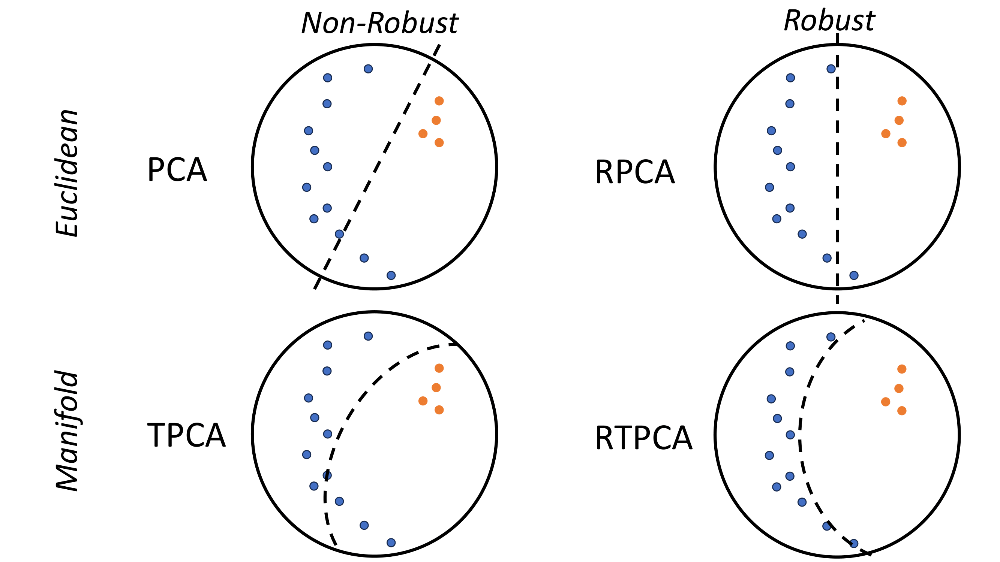

# Fun with Flags: Robust Principal Directions via Flag Manifolds

## Description

This is the code for **Fun with Flags: Robust Principal Directions via Flag Manifolds**



### Abstract
Principal component analysis (PCA), along with its extensions to manifolds and outlier contaminated data, have been indispensable in computer vision and machine learning. In this work, we present a unifying formalism for PCA and its variants, and introduce a framework based on the flags of linear subspaces, \ie a hierarchy of nested linear subspaces of increasing dimension, which not only allows for a common implementation but also yields novel variants, not explored previously. We begin by generalizing traditional PCA methods that either maximize variance or minimize reconstruction error. We expand these interpretations to develop a wide array of new dimensionality reduction algorithms by accounting for outliers and the data manifold. To devise a common computational approach, we recast robust and dual forms of PCA as optimization problems on flag manifolds. We then integrate tangent space approximations of principal geodesic analysis (tangent-PCA) into this flag-based framework, creating novel robust and dual geodesic PCA variations. The remarkable flexibility offered by the 'flagification' introduced here enables even more algorithmic variants identified by specific flag types. Last but not least, we propose an effective convergent solver for these flag-formulations employing the Stiefel manifold. Our empirical results on both real-world and synthetic scenarios, demonstrate the superiority of our novel algorithms, especially in terms of robustness to outliers on manifolds.

### How to Cite

```Bibtex
@misc{mankovich2024fun,
      title={Fun with Flags: Robust Principal Directions via Flag Manifolds}, 
      author={Nathan Mankovich and Gustau Camps-Valls and Tolga Birdal},
      year={2024},
      eprint={2401.04071},
      archivePrefix={arXiv},
      primaryClass={cs.CV}
}
```


## Getting Started

### Dependencies

See `requirements.txt` for Python dependencies. Was built with Python 3.10.9

### Quick Start (Python)

1. Initialize conda environment

    ```
    conda create --name flag_dim_red python=3.8.8
    conda activate flag_dim_red
    ```

1. Install requirements

    ```
    pip install -r ./requirements.txt
    ```

1. Visit GettingStarted.ipynb For an introduction to robust principal directions via flag manifolds


## Organization

* Euclidan - experiments working with Euclidean data
* Faces- outlier detection with cropped YaleFaceDatabase B and Caltech101
* Grassmannian- synthetic datasets on Gr(2,4)
* Hands- hands dataset
* RemoteSensing- outlier detection with merced landuse dataset
* Sphere- synthetic datasets on Spheres
* scripts- workhorse scripts for all the examples


## Authors

Nathan Mankovich, Gustau Camps-Valls, and Tolga Birdal: [email](mailto:nathan.mankovich@gmail.com)

